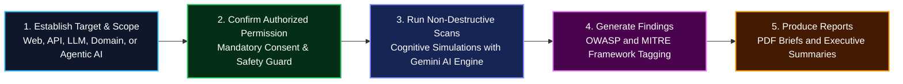
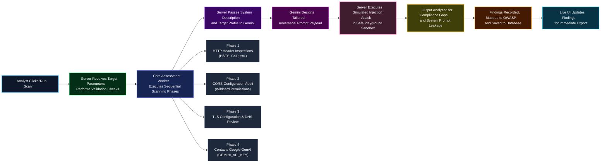

  
# AetosAI

# Agentic AI SaaS Security Platform

## Red Team Assessment, AI Security Review, and Analyst-Focused Security Reporting

— Analyst-focused red team assessment, AI security review, and executive reporting for modern web, API, LLM, and agentic AI environments.

  
  
  
  

---

## 1. Executive Summary

The **Agentic AI SaaS Security Platform** (developed under the internal suite name **AetosAI**) is an advanced, full-stack, analyst-centric security assessment platform. It is designed to empower security analysts, red teamers, AppSec engineers, and AI safety professionals to evaluate the posture of classic web assets, public APIs, domain configurations, Large Language Model (LLM) applications, and complex autonomous multi-agent systems.

Rather than relying on fragmented, disjointed CLI utilities, the platform consolidates traditional network/web testing with emerging cognitive and semantic threat evaluation workflows. This includes testing for prompt injection, goal hijacking, excessive agency, and memory corruption.

Operating strictly under an authorized, safe-by-design methodology, the platform ensures that security personnel can simulate real-world attacks, inspect live server-side execution streams, map discovered vulnerabilities to standard industry frameworks (such as the OWASP Web Top 10, OWASP LLM Top 10, and the new OWASP Agentic AI Top 10 / ASI 2026 guidelines), and automatically construct comprehensive executive or developer-oriented remediation reports.

---

<strong>Table of Contents</strong>

- [1. Executive Summary](#1-executive-summary)
- [2. Purpose of the Application](#2-purpose-of-the-application)
- [3. Problem Statement](#3-problem-statement)
- [4. High-Level Solution](#4-high-level-solution)
- [5. Core Features](#5-core-features)
- [6. How the Application Works](#6-how-the-application-works)
- [7. Security and Authorization Model](#7-security-and-authorization-model)
- [8. OWASP and Security Framework Mapping](#8-owasp-and-security-framework-mapping)
- [9. User Guide: How to Use the Application](#9-user-guide-how-to-use-the-application)
- [10. Analyst Workflow](#10-analyst-workflow)
- [11. Example Use Cases](#11-example-use-cases)
- [12. Report Output Explanation](#12-report-output-explanation)
- [13. Business Value](#13-business-value)
- [14. Technical Value](#14-technical-value)
- [15. Limitations](#15-limitations)
- [16. Future Enhancements](#16-future-enhancements)
- [17. Summary](#17-summary)

---

## 2. Purpose of the Application

In the current technological landscape, organizations are rapidly adopting AI, deep learning models, retrieval-augmented generation (RAG) structures, and autonomous multi-agent systems to automate customer service, internal operations, and product workflows. However, this deployment is outpacing the security controls required to protect them. 

The application exists to address this gap:
* **The AI Adoption Paradox**: Autonomous agents are granted access to sensitive enterprise tools, APIs, and databases (excessive agency) before security teams have established robust validation and sandboxing.
* **Complex Threat Landscapes**: Traditional static analysis and classic dynamic application security testing (DAST) cannot detect semantic issues such as instruction override, system prompt leakage, or indirect prompt injection via poisoned RAG pipelines.
* **Analyst Workload Reduction**: Security teams require a consolidated interface that standardizes findings, captures real-time evidence, details technical and business impact, and outputs actionable remediation guidelines.
* **Ethics and Authorization First**: The platform mandates explicit testing authorization, emphasizing low-impact, safe simulation payloads rather than dangerous, destructive, or service-disrupting exploitation.

---

## 3. Problem Statement

Modern AppSec and red team divisions face major barriers when defending hybrid environments:

1. **Fragmented Security Tooling**: Traditional vulnerability management platforms scan for classic web flaws (e.g., SQLi, XSS) but are completely blind to AI-specific risks like prompt injection, goal hijacking, and tool manipulation.
2. **Evidence Collection Bottleneck**: Security analysts waste significant time manually compiling attack payloads, capturing terminal logs, verifying CORS origins, checking security headers, and mapping results to frameworks.
3. **The Rise of "Excessive Agency" and "Goal Hijacking"**: Autonomous agent systems can be subverted by simple text payloads mixed into benign data feeds. This allows attackers to hijack agent workflows, run unauthorized code, or extract system secrets.
4. **Communication Gap with Stakeholders**: Technical analysts need detailed JSON and raw HTTP evidence to fix code, while executive leadership requires plain-English risk assessments, business impact summaries, and governance alignments.

---

## 4. High-Level Solution

The platform addresses these issues through a highly automated, structured security assessment workflow:

1. **Target Profiling**: The analyst defines the target (e.g., a corporate portal, public API endpoint, customer service chat widget) and selects the corresponding assessment scope.
2. **Safety Enforcer**: The interface requires explicit user consent, confirming that the analyst possesses authorized permission to test.
3. **Multi-Phase Automated Assessment**: The back-end initiates a fast, safe-by-design evaluation checking security headers, CORS origin access controls, TLS certificates, and domain DNS health.
4. **Adversarial Cognitive Simulation**: For LLM and Agentic AI targets, the platform uses a server-side Google GenAI pipeline (`gemini-3.5-flash` with high-availability fallback to `gemini-3.1-flash-lite`) to safely generate specialized, context-aware prompt injection and goal override payloads to evaluate the target's alignment boundaries.
5. **Interactive Playgrounds**: Analysts can access a "Pen-Testing Sandbox" to manually fire payload vectors and observe how the system defends or fails.
6. **Unified Compliance Report**: Identified issues are detailed with title, severity (Critical, High, Medium, Low), detailed evidence, risk descriptions, remediation steps, and corresponding taxonomy mappings.

---

## 5. Core Features

### Dashboard
The unified dashboard serves as the administrative hub for active security assessments:
* **Metrics Snapshot**: Displays total security assessments run, total findings logged, and an interactive critical/high severity count.
* **Risk Trend Charts**: Uses data visualizations (`recharts`) to present historical trends, helping teams track risk burn-down rates.
* **Recent Activity Log**: Shows a chronological list of recent scans, including target URLs, assessment types, risk states, and direct links to reports.

### Run Assessment Page
The core interface where analysts establish scanning scopes:
* **Target Specifier**: Interactive search bar with validation for URLs, API endpoints, domains, and IP addresses.
* **Scope Selector**: Allows switching between Web, API, Domain/IP, LLM Application, Agentic AI, or Unified.
* **Authorization Gate**: A mandatory confirmation checkbox enforcing ethical and authorized security reviews.
* **Live Shell Stream**: An interactive console displaying the active operations (e.g., initial DNS lookup, header verification, CORS inspection, cognitive safety simulation).

### Supported Target Types
* **Website URLs**: Public front-end portals and administrative logins.
* **Domains & IP Addresses**: Subdomains and public hosting servers.
* **API Endpoints**: Public REST/RESTful endpoints, GraphQL gateways, and API routes.
* **Autonomous Agents / Chatbots**: Front-facing LLM endpoints, customer assistants, and tool-connected agents.

### Assessment Types
* **WEB**: Classic AppSec testing. Validates HSTS, X-Frame-Options, Content Security Policies (CSP), and common web misconfigurations.
* **API**: Endpoint boundary testing. Inspects CORS `Access-Control-Allow-Origin: *` issues, header parameters, and endpoint exposure.
* **DOMAIN_IP**: Server configuration and infrastructure review. Validates SSL/TLS certificates, cipher suite strength, and DNS records (MX, SPF, DMARC, TXT).
* **LLM_APP**: Semantic testing. Simulates direct/indirect prompt injection, system prompt extraction, and sensitive data leakage.
* **AGENTIC_AI**: Advanced behavioral verification. Examines autonomous execution limits, excessive agency, tool abuse potential, and multi-agent cascading loops.
* **UNIFIED**: The full-spectrum assessment combining all of the above tests into a single run.

### Live Analysis / Execution Logs
As scans run, a live terminal output prints clear logs:
* `[INFO] Initializing handshake with target...`
* `[SCAN] Checking HSTS and security header enforcement...`
* `[SCAN] Verifying CORS policies for origin wildcard exposure...`
* `[AI] Simulating adversarial prompt injection payloads...`
* `[PAYLOAD] Payload override evaluation successful. Recording results...`

### Pen-Testing Sandbox
An interactive sandbox page designed for manual testing:
* **Attack Payload Generator**: Leverages the Gemini API to construct custom, context-appropriate prompt injections based on the target agent's purpose.
* **Interactive Chat Console**: Permits analysts to submit payloads directly to the target system in real-time, checking for instruction refusals or system prompt leakage.
* **Refusal Evaluation Engine**: Evaluates response strings to determine if the target successfully blocked the attack vector or printed sensitive back-end secrets.

### Supply Chain Auditor (SCA)
A focused dependency auditor checking project software structures:
* **Dependency Visualizer**: Lists imported NPM packages, licenses, and library sizes.
* **Vulnerability Mapping**: Automatically flags known outdated dependencies or software vulnerabilities.
* **Framework Alignment**: Links package issues to the supply chain guidelines in OWASP Web and OWASP LLM categories.

### OWASP Reference Deck
A built-in educational and compliance knowledge base:
* **Interactive Framework Cards**: Covers full categories for OWASP Web Top 10, OWASP LLM Top 10, and OWASP Agentic AI Top 10.
* **Actionable Examples**: Lists practical attack scenarios, defense guidelines, and code snippets for each category.

### Platform Settings
An administrative panel to control scan profiles and external integrations:
* **Scan Pacing Controls**: Adjust standard rate limits (Requests Per Second), network timeout periods, and redirect hop counts.
* **Reporting Options**: Toggles specific elements in generated reports, such as business impact sections, manual analyst notes, remediation steps, and framework mappings.
* **Integration Credentials**: Allows analysts to securely supply external API keys (OpenAI, Gemini, Shodan, VirusTotal, Jira, ServiceNow, HackerOne, Slack Webhooks) to enrich scans. Includes safety masking (`●●●●●●●●`) to protect secrets.
* **Cryptographic Audit Log**: A persistent log of platform configuration changes, report downloads, and scan activities, supporting SOC2 and ISO 27001 compliance tracking.

---

## 6. How the Application Works

### Technical Stack
* **Front-End**: React 18+ (Vite) structured with TypeScript. Styled with Tailwind CSS for a modern, responsive layout. It features animations powered by `motion` (`motion/react`) for fluid view transitions and micro-interactions.
* **Back-End**: Express (Node.js) server running as an ES Module/CommonJS build, compiling into a unified, high-performance `dist/server.cjs` file using `esbuild`.
* **Database**: High-performance in-memory state engine designed for fast development and testing environments, with pre-seeded, realistic assessment structures, historical reports, and system logs.
* **AI Engine**: Server-side Google GenAI SDK (`@google/genai`) to power prompt generation, chat simulation, and executive report creation.
* **API Ingress**: Binds directly to port `3000` on host `0.0.0.0` for deployment in Cloud Run containerized environments.

### Assessment Execution Lifecycle

---

## 7. Security and Authorization Model

The application enforces a professional and ethical security boundary:
* **Authorization Requirement**: Scans cannot proceed without the analyst explicitly confirming authorization. This establishes a clear legal and compliance record for internal or external pen-testing.
* **Safe-by-Design Audits**: Checks do not execute brute-force password cracking, Denial of Service (DoS) attacks, buffer overflow memory corruption, or real shell exploit payloads.
* **Active Protection / Model Fallback**: The server-side code uses robust handling for external AI calls. If the primary evaluation engine (`gemini-3.5-flash`) experiences service spikes or 503 transient errors, it automatically falls back to high-availability `gemini-3.1-flash-lite` with exponential backoff. This ensures scan availability even under high network demand.

---

## 8. OWASP and Security Framework Mapping

The platform aligns all discovered vulnerabilities to three core frameworks, giving AppSec managers immediate clarity on risk taxonomies:

### OWASP Web Top 10
Traditional application vulnerabilities are automatically mapped to classic OWASP Web standards:
* **A05:2021-Security Misconfiguration**: Flagged when targets omit standard security headers (`Strict-Transport-Security`, `X-Frame-Options`, `Content-Security-Policy`).
* **A01:2021-Broken Access Control**: Flagged when CORS headers are configured with wildcard permissions (`Access-Control-Allow-Origin: *`) on authenticated routes, exposing API payloads to remote scripts.

### OWASP Top 10 for LLM Applications
AI-specific vulnerabilities map to emerging LLM threat structures:
* **LLM01: Prompt Injection**: Flagged when an attacker can hijack the model's instructions using malicious inputs.
* **LLM06: Sensitive Information Disclosure**: Flagged when the LLM outputs private administrative keys, proprietary prompts, or database credentials.
* **LLM07: Insecure Plugin Design / Excessive Agency**: Flagged when tools are connected to models without strict confirmation boundaries.

### OWASP Agentic AI / ASI 2026
The platform is aligned with the newest agentic security mappings:

| Category | Title | Platform Target & Detection Method |
| :--- | :--- | :--- |
| **ASI01** | **Agent Goal Hijack** | Simulates indirect injections to attempt to redirect the agent's core purpose. |
| **ASI02** | **Tool Misuse & Exploitation** | Tests if the agent can be tricked into calling internal utility tools with custom arguments. |
| **ASI03** | **Identity & Privilege Abuse** | Inspects if user-context boundaries are missing on tool calls, allowing unauthorized actions. |
| **ASI04** | **Agentic Supply Chain** | The SCA module analyzes third-party packages, prompt libraries, and integrations. |
| **ASI05** | **Unexpected Code Execution / RCE** | Validates if Python or shell-execution runtimes lack isolation sandboxing. |
| **ASI06** | **Memory & Context Poisoning** | Evaluates if dynamic database inputs can taint the long-term context of the agent. |
| **ASI07** | **Insecure Inter-Agent Comm** | Checks for encryption and authentication between multiple interacting agents. |
| **ASI08** | **Cascading Failures** | Tests if an error in a sub-agent causes crashes across the entire system. |
| **ASI09** | **Human-Agent Trust Exploitation**| Evaluates if the agent can generate misleading or manipulative outputs. |
| **ASI10** | **Rogue Agents** | Audits the agent's enforcement limits to prevent actions outside its approved scope. |

---

## 9. User Guide: How to Use the Application

### Step 1: Log In & Onboarding
* Access the platform through the web browser.
* Use the optional **Interactive Tour** button in the top navigation bar to start an step-by-step guided walkthrough of the core system components.

### Step 2: Open the Dashboard
* Check the dashboard to review historical findings, active assessments, and current risk metrics.

### Step 3: Run an Assessment
* Click **Run Assessment** in the left sidebar or top mobile tab navigation.
* Select your target profile (e.g., *Customer Support Agent* or *External Bank Portal*).

### Step 4: Define the Target Parameters
* Enter the target URL, API endpoint, or domain name in the target address field.
* Ensure you match standard formats (e.g., `https://portal.internal-bank.com`).

### Step 5: Select the Assessment Type
* Choose the scanning profile that matches your target:
  * Choose **AGENTIC_AI** or **LLM_APP** for AI agents and chat interfaces.
  * Choose **WEB**, **API**, or **DOMAIN_IP** for classic infrastructure.
  * Select **UNIFIED** for a full-spectrum security audit.

### Step 6: Confirm Authorization Consent
* Read the safety terms of service.
* Check the **"I confirm that I have explicit written authorization..."** checkbox to enable the assessment button.

### Step 7: Launch & Observe Logs
* Click **Start Safe Assessment**.
* Watch the live terminal output to trace active tests (DNS checks, header checks, TLS certificates, prompt injection simulations).

### Step 8: Review Findings
* Expand the **Findings Identified** list once the scan completes.
* Click on individual findings to view their severity, evidence, risk impact, and remediation steps.

### Step 9: Use the Sandbox for Manual Verification
* Navigate to the **Pen-Testing Sandbox** tab.
* Submit custom payloads to manually verify vulnerabilities found during the automated scan.

### Step 10: Generate Reports
* Navigate to the **Compliance Report Output** tab.
* Click **Generate Executive Report** to create an AI-powered executive summary using the Gemini API.
* Click **Print Report** or use standard export controls to download the results.

---

## 10. Analyst Workflow

The platform aligns with standard vulnerability management lifecycles:

```mermaid
flowchart LR
    A["&nbsp;&nbsp;&nbsp;&nbsp;1. IDENTIFY TARGET&nbsp;&nbsp;&nbsp;&nbsp;<br>Input URL, Domain, or Agent Endpoint"]
    B["&nbsp;&nbsp;&nbsp;&nbsp;2. RUN AUTOMATED SCAN&nbsp;&nbsp;&nbsp;&nbsp;<br>Safe scans gather headers, DNS, and certificates"]
    C["&nbsp;&nbsp;&nbsp;&nbsp;3. SIMULATE INJECTIONS&nbsp;&nbsp;&nbsp;&nbsp;<br>Gemini-designed payloads test AI targets"]
    D["&nbsp;&nbsp;&nbsp;&nbsp;4. VALIDATE IN SANDBOX&nbsp;&nbsp;&nbsp;&nbsp;<br>Manually fire payloads to confirm findings"]
    E["&nbsp;&nbsp;&nbsp;&nbsp;5. MAP COMPLIANCE&nbsp;&nbsp;&nbsp;&nbsp;<br>View vulnerabilities tagged with OWASP / ASI rules"]
    F["&nbsp;&nbsp;&nbsp;&nbsp;6. REPORT & REMEDIATE&nbsp;&nbsp;&nbsp;&nbsp;<br>Export report with detailed remediation steps"]

    A --> B --> C --> D --> E --> F

    style A fill:#0f172a,stroke:#38bdf8,stroke-width:2px,color:#ffffff
    style B fill:#052e16,stroke:#22c55e,stroke-width:2px,color:#ffffff
    style C fill:#172554,stroke:#818cf8,stroke-width:2px,color:#ffffff
    style D fill:#3b0764,stroke:#c084fc,stroke-width:2px,color:#ffffff
    style E fill:#4a044e,stroke:#e879f9,stroke-width:2px,color:#ffffff
    style F fill:#451a03,stroke:#f59e0b,stroke-width:2px,color:#ffffff
```

---

## 11. Example Use Cases

### Use Case 1: Traditional Web Security Review
* **Target**: `https://portal.internal-bank.com`
* **Scan Type**: WEB
* **Execution**: Automated probes check for security headers.
* **Result**: Discovers missing HSTS and X-Frame-Options headers. Flags a **Medium Risk** finding for vulnerability to Clickjacking and MITM attacks, mapping to **OWASP A05:2021-Security Misconfiguration**.

### Use Case 2: API Integration Audit
* **Target**: `https://api.internal-bank.com/v1/user`
* **Scan Type**: API
* **Execution**: Probes the endpoint's response headers.
* **Result**: Detects `Access-Control-Allow-Origin: *` over an authenticated route. Flags a **High Risk** finding for CORS Wildcard Exposure, mapping to **OWASP A01:2021-Broken Access Control**.

### Use Case 3: LLM Application Security Review
* **Target**: Internal customer support chatbot.
* **Scan Type**: LLM_APP
* **Execution**: Simulates adversarial prompt injection and system instruction leakage attempts.
* **Result**: The simulated chatbot leaks private administrative keys and backend variables in response to injection prompts. Flags a **High Risk** finding for System Prompt Leakage and Sensitive Information Disclosure, mapping to **OWASP LLM06**.

### Use Case 4: Autonomous Agent Boundary Audit
* **Target**: Autonomous AI agent connected to corporate tools.
* **Scan Type**: AGENTIC_AI
* **Execution**: Evaluates boundaries for tool execution and excessive agency.
* **Result**: The agent attempts to run unauthorized database wipe commands when confronted with direct instruction overrides. Flags a **Critical Risk** finding for Excessive Agency and Tool Misuse, mapping to **OWASP ASI01 (Agent Goal Hijack)** and **ASI02 (Tool Misuse)**.

---

## 12. Report Output Explanation

Every generated assessment report includes:
* **Header Metadata**: Target, Assessment Type, Date/Time Stamp, and overall Target Risk Level (e.g., HIGH RISK, SECURE).
* **Vulnerability Summary Card**: A high-level visual card detailing total findings, severity distribution, and technical impact.
* **Detailed Findings**: Detailed listings of each vulnerability containing:
  * **Title & Severity**: Rated Critical, High, Medium, or Low.
  * **Evidence**: The specific payload, returned response, or missing header detected.
  * **Risk Explanation**: Clear technical details of why this is a risk.
  * **Recommended Remediation**: Step-by-step code or configuration changes to fix the issue.
  * **Framework Taxonomy**: Visual labels linking the issue to OWASP Web, LLM, or Agentic AI guidelines.
* **AI Executive Summary**: A plain-English report generated by Gemini, explaining technical findings, business impact, and remediation roadmaps for non-technical leadership.

---

## 13. Business Value

Implementing this platform provides key business advantages:
* **Securing AI Innovation**: Allows organizations to confidently adopt AI and autonomous agents while maintaining robust security controls.
* **Resource Optimization**: Automates evidence collection and analysis, freeing security teams to focus on core engineering and architecture.
* **Regulatory Compliance**: Maps findings to industry-standard frameworks, directly supporting SOC2, ISO 27001, and HIPAA compliance audits.
* **Cross-Functional Communication**: Closes the communication gap between technical AppSec teams and executive leadership with automated reporting.

---

## 14. Technical Value

From an engineering perspective, the platform delivers strong technical utility:
* **Unified Security Suite**: Consolidates network checks, web audits, API probes, and AI security assessments into a single platform.
* **Context-Aware Testing**: Uses generative AI to design tailored, context-specific prompt injection payloads instead of using static checklists.
* **Interactive Verification**: Includes a real-time sandbox for analysts to quickly test and confirm findings manually.
* **Production-Ready Architecture**: Built with TypeScript, clean Express API routes, server-side secrets management, and robust error-handling with automated model fallback.

---

## 15. Limitations

For professional transparency, users should note the current limitations of this MVP:
* **Safe-by-Design Probes Only**: The platform is built for non-destructive testing. It does not perform active privilege escalation, execute real malware payloads, or perform denial-of-service (DoS) tests.
* **In-Memory Ledger**: This version uses a secure in-memory database. Session histories and audit logs reset when the back-end dev server restarts.
* **Simulated Network Targets**: External network checks use safe, local server-side simulations. Real external network connectivity requires appropriate cloud configurations.
* **Human Validation Recommended**: AI-generated findings and executive summaries are designed to support analysts, but should be reviewed by a human professional before production deployment.

---

## 16. Future Enhancements

* **Persistent Database Storage**: Migrate from the in-memory ledger to a production-ready database (such as Firebase Firestore or PostgreSQL) for long-term data storage.
* **Active Third-Party Integrations**: Fully connect Shodan, VirusTotal, Jira, ServiceNow, and Slack APIs to enable automated ticketing, active threat feeds, and instant alert channels.
* **Scheduled Scans**: Add cron-based scheduling to run automated, recurring assessments of corporate portals and agents.
* **Multi-Tenant RBAC**: Implement Role-Based Access Control (RBAC) to allow secure, multi-tenant collaboration across enterprise security teams.
* **Expanded PDF Export**: Build a dedicated server-side PDF generator to allow analysts to download and save reports with one click.

---

## 17. Summary

The **Agentic AI SaaS Security Platform** delivers a modern, robust, and professional solution for assessing application security in the AI era. By combining traditional web and API audits with cutting-edge AI security simulations and compliance mapping, the platform provides security teams with the exact tools they need to secure autonomous systems. This project stands as a production-ready template for enterprise AI security governance, red-team assessment workflows, and clear vulnerability management.
